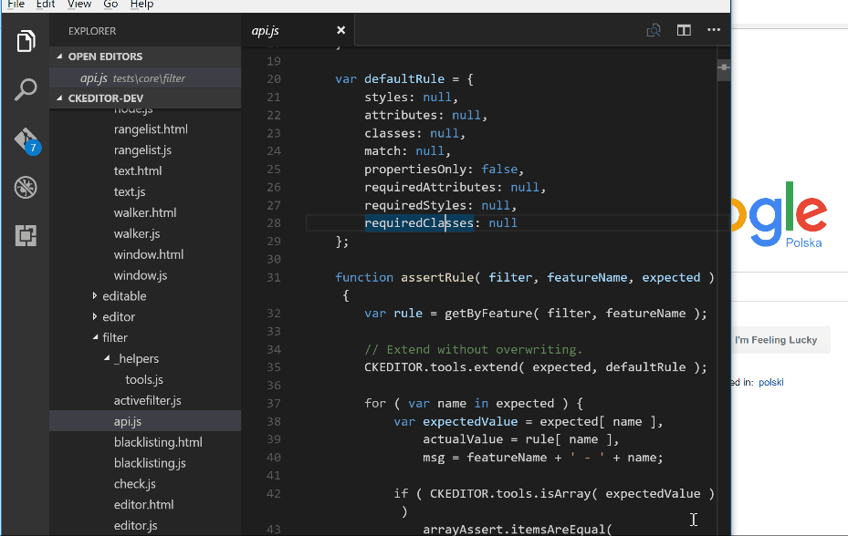

# CKEditor 4 test mate

Very simple extension to make working with CKEditor 4 tests easier. So far it's created as a side project to check if all macros can be moved to VSC.

## Features

Currently the only command available is to run current file inside of the browser.

By default you can also access it with `ctrl + shift + alt + u` hotkey

## Extension Settings

Include if your extension adds any VS Code settings through the `contributes.configuration` extension point.

For example:

This extension contributes the following settings:

* `myExtension.enable`: enable/disable this extension
* `myExtension.thing`: set to `blah` to do something
